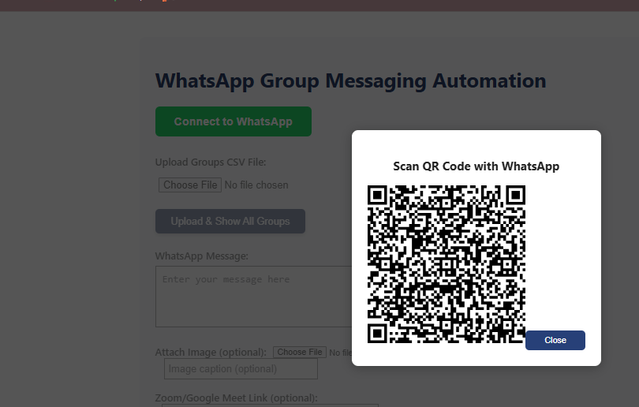
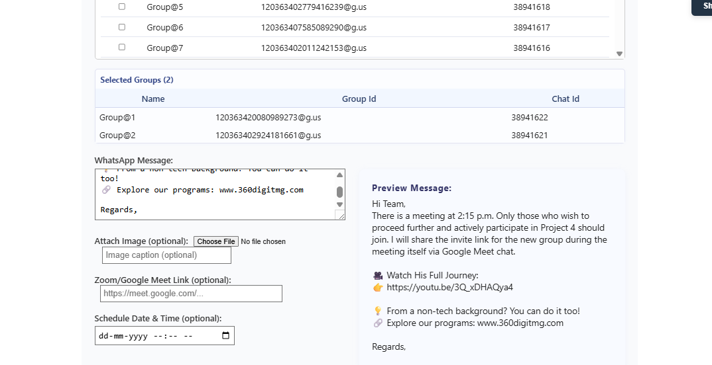
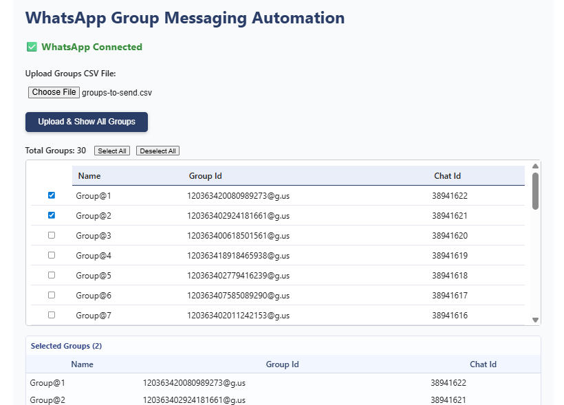

WhatsApp Automation UI
Automate WhatsApp messaging with ease! This project includes a backend powered by Baileys for WhatsApp Web automation and a React frontend with rich-text editing for message customization. Send scheduled broadcasts to WhatsApp groups, communities, or individuals with real-time status updates and QR code connection support.

Table of Contents
About

Features

Setup & Installation

Usage

Frontend UI

Backend API

Screenshots

Contributing

License

Contact

About
This project automates sending WhatsApp messages to multiple groups or contacts via a user-friendly web UI. It integrates the Baileys library to interact with WhatsApp Web using a QR code login. The frontend supports rich text formatting and image attachments, while the backend handles scheduling, group management, and delivery status updates.

Features
Connect to WhatsApp Web via QR Code scanning

Send text and image messages to groups, communities, and individuals

Rich text editor for message formatting (bold, italics, underline, etc.)

CSV upload for bulk group/contact import

Schedule messages to be sent later

Real-time message status updates (sent, failed) via WebSockets

Fetch and list all WhatsApp groups and communities

Email notifications for message status (optional)

Setup & Installation
Prerequisites
Node.js (v16 or newer)

npm or yarn

Git

Clone repository
bash
git clone https://github.com/ChaithuCE/whatsapp-automation-ui.git
cd whatsapp-automation-ui
Backend Setup
bash
cd server
npm install
Replace SMTP settings in app.js with your own email credentials if email notifications are needed.

Start the backend server:

bash
node app.js
Frontend Setup
bash
cd ../client
npm install
npm start
Open frontend at http://localhost:3000

Usage
Start backend (node app.js)

Open frontend in browser

Click “Connect to WhatsApp” and scan the QR code with your WhatsApp mobile app

Upload CSV file or select groups

Compose message with rich text or image attachment

Schedule or send immediately

Monitor live message status

Frontend UI
The frontend features a rich-text editor powered by react-quill for message customization, a group selection interface, and real-time WebSocket status logs.

Backend API Endpoints (Partial)
GET /whatsapp-qr - Fetch current QR code

GET /get-groups - List WhatsApp groups and communities

POST /upload-csv - Upload CSV file of groups or contacts

POST /send-messages - Send or schedule messages

Screenshots
### QR Code Login

### Message Editor with Rich Text

### Group Selection and Status Logs

Contributing
Pull requests are welcome. Please open issues for bug reports or feature requests.

License
Specify your license here (e.g., MIT License).

Contact
Nuthakki Chaitanya
Email: marteen837@gmail.com
GitHub: https://github.com/ChaithuCE

